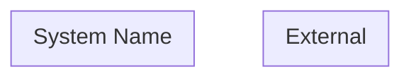
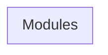
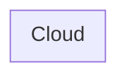
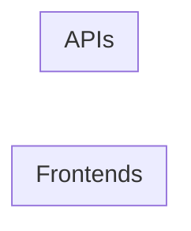

# Architecture Diagrams

## Metadata

| Field | Value |
|---|---|
| Version | v1 |
| Created At | YYYY-MM-DD |
| Updated At | YYYY-MM-DD |
| Status | DRAFT / REVIEW / APPROVED |

---

## 1. System Context Diagram

사용자 유형, 외부 시스템, 서비스 관계를 보여준다.

---

## 2. Container Diagram

frontend, backend, DB, storage, external API, batch, queue 등의 관계를 보여준다.

---

## 3. Module Boundary Diagram

도메인별 내부 모듈 경계와 의존을 보여준다.

---

## 4. Deployment Diagram

실제 배포 인프라 구조를 보여준다.

---

## 5. Frontend App Diagram (프론트 여러 개인 경우)

각 프론트엔드 앱이 어떤 API와 권한을 사용하는지 보여준다.

---

## 6. Data Flow Diagram (필요시)

-

## 7. Security Boundary Diagram (필요시)

-

## 8. Event / Async Flow Diagram (필요시)

-

---

## Notes

-
