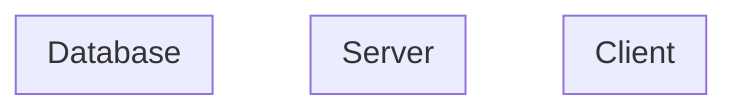
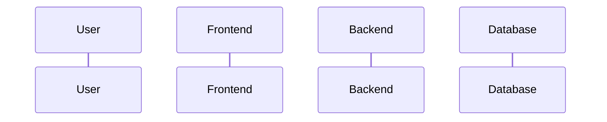

# Architecture Specification

## Metadata

| Field | Value |
|---|---|
| Version | v1 |
| Created At | YYYY-MM-DD |
| Updated At | YYYY-MM-DD |
| Status | DRAFT / REVIEW / APPROVED |

---

# System Architecture

## 기술 스택

| 계층 | 기술 | 비고 |
|---|---|---|
| Frontend |  |  |
| Backend |  |  |
| Database |  |  |
| Infra |  |  |

## 시스템 구성도



---

# Module Boundaries

## 모듈 목록

| 모듈 | 도메인 | 책임 | 의존 |
|---|---|---|---|
|  |  |  |  |

## 모듈 간 통신

-

---

# Runtime Flow

## 요청 처리 흐름

```text
Client → API Gateway → Controller → Service → Repository → Database
```

## 인증 흐름

-

## 에러 처리 흐름

-

---

# Sequence Diagrams

## [흐름명]



## Notes

-
