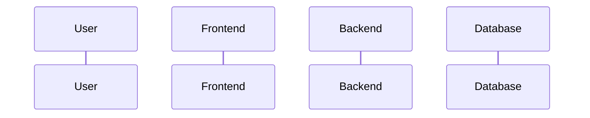

# Sequence Diagrams

## Metadata

| Field | Value |
|---|---|
| Version | v1 |
| Created At | YYYY-MM-DD |
| Updated At | YYYY-MM-DD |
| Status | DRAFT / REVIEW / APPROVED |

---

도메인별 핵심 흐름을 작성한다. 대표 시퀀스 하나만 만들지 않는다.

관련 아키텍처 다이어그램: `docs/04_architecture/architecture_diagrams.md`

## [도메인명]

### SEQ-{DOMAIN}-001 [흐름명]

| 연결 | ID |
|---|---|
| 관련 기능 ID |  |
| 관련 화면 ID |  |
| 관련 API ID |  |
| 관련 테이블 |  |

### SEQ-{DOMAIN}-002 [흐름명]

| 연결 | ID |
|---|---|
| 관련 기능 ID |  |
| 관련 화면 ID |  |
| 관련 API ID |  |
| 관련 테이블 |  |

## Notes

-
