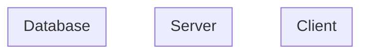

# System Architecture

## Metadata

| Field | Value |
|---|---|
| Version | v1 |
| Created At | YYYY-MM-DD |
| Updated At | YYYY-MM-DD |
| Status | DRAFT / REVIEW / APPROVED |

## 1. 기술 스택

| 계층 | 기술 | 비고 |
|---|---|---|
| Frontend |  |  |
| Backend |  |  |
| Database |  |  |
| Infra |  |  |
| External |  |  |

## 2. 시스템 구성도

## 3. 배포 구조

## 4. 외부 연동

| 외부 서비스 | 용도 | 연동 방식 | 비고 |
|---|---|---|---|

## 5. 보안 기준

## 6. 성능/확장성 고려사항

## Notes

-
