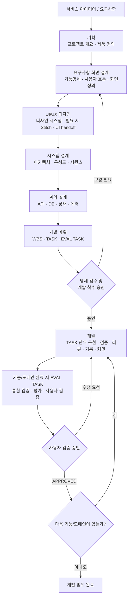
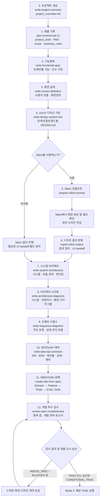
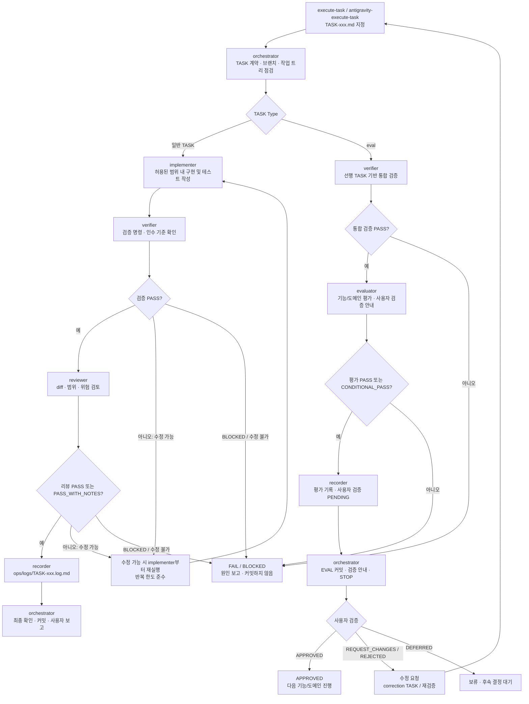

# harness-dev

AI 하네스 엔지니어링을 위한 프로젝트 템플릿. **기획·설계·디자인 문서를 완성한 뒤, WBS에서 정의한 TASK를 단위별로 구현·검증·기록**한다.

실행 정책은 [AGENTS.md](AGENTS.md), 단계별 사용 프롬프트는 [HARNESS-DEV.md](HARNESS-DEV.md)를 참고한다.

## 1. 전체 스킬 워크플로우

- **Mode 1 — General / Analysis:** 저장소 분석·문서 점검·계획 검토. TASK 파일 없이 수행할 수 있다.
- **Mode 2 — Planning / Specification:** 아래 0~12단계의 문서를 작성·검수한다. **소스 코드는 구현하지 않는다.**
- **Mode 3 — TASK Execution:** 사용자가 `execute-task`(Codex) 또는 `antigravity-execute-task`(Antigravity)로 지정한 `ops/tasks/TASK-xxx.md` 하나를 실행한다. 브랜치와 허용/금지 파일을 먼저 확인한다.

## 2. Mode 2 — 기획 → 설계 → 디자인 → 개발 준비

다음 다이어그램의 번호는 [HARNESS-DEV.md의 Mode 2 문서 완성 순서](HARNESS-DEV.md#3-mode-2-문서-완성-순서)와 일치한다. 상자의 영문 이름은 실제 `.agents/skills/<스킬명>/SKILL.md` 경로에 대응한다.

**Stitch는 선택 경로**다. `prepare-stitch-prompt`는 프롬프트를 작성하며 Stitch 자체를 실행하지 않는다. Stitch 결과를 사용한 경우 `ingest-stitch-output`으로 화면정의·디자인 기준과 대조한 뒤 UI handoff를 정리한다. Stitch를 생략하더라도 프론트엔드 구현에 필요한 화면정의·DESIGN.md·UI handoff는 개발 착수 전에 준비한다.

**명세 검수는 구현 실행이 아니다.** `review-spec-completeness`는 누락 사항과 착수 가능 여부를 보고한다. 보강이 필요한 경우 관련 Mode 2 단계로 돌아가 문서를 수정한 후 재검수한다.

## 3. Mode 3 — TASK별 반복 개발 및 EVAL

일반 TASK의 고정 순서는 **orchestrator → implementer → verifier → reviewer → recorder → commit**이다. EVAL TASK는 구현을 하지 않고 **orchestrator → verifier → evaluator → recorder → commit → 사용자 검증 안내 → STOP** 순서로 수행한다. 사용자 `APPROVED` 전에는 다음 기능 그룹으로 넘어가지 않는다. 실패·차단된 TASK는 커밋하지 않는다.

각 스킬의 상세 입력·출력 및 실행 프롬프트는 [HARNESS-DEV.md](HARNESS-DEV.md), TASK 경계·승인·평가 규칙은 [AGENTS.md](AGENTS.md)를 따른다.
